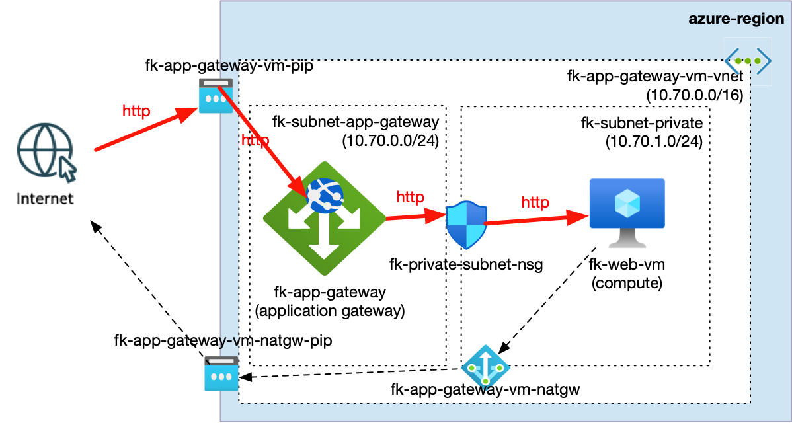
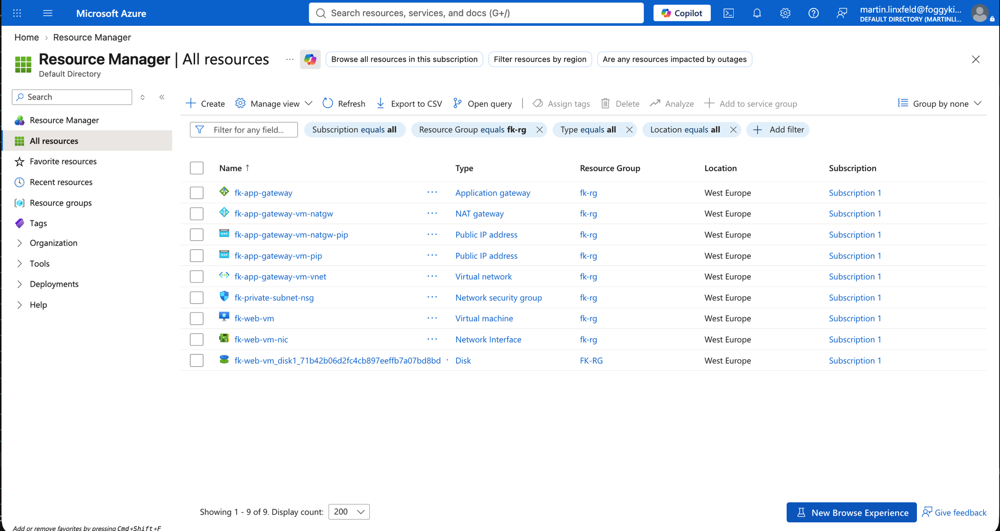
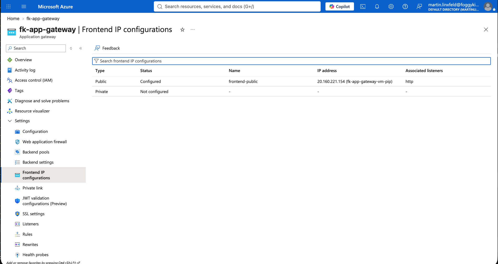
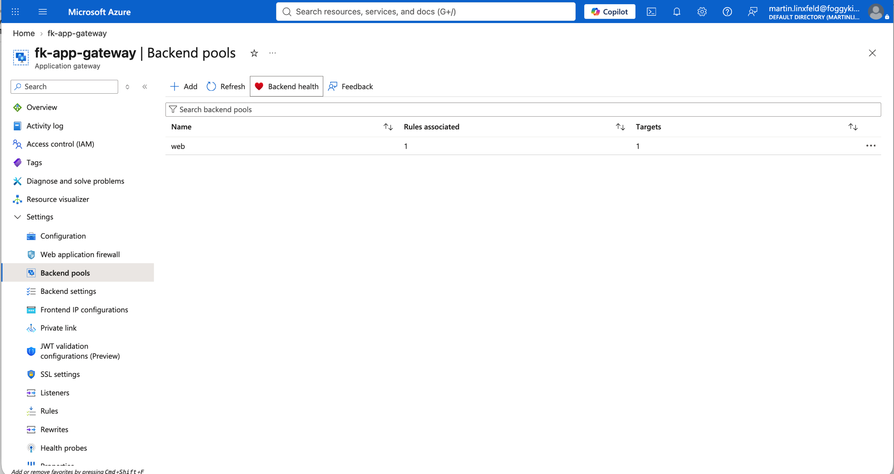
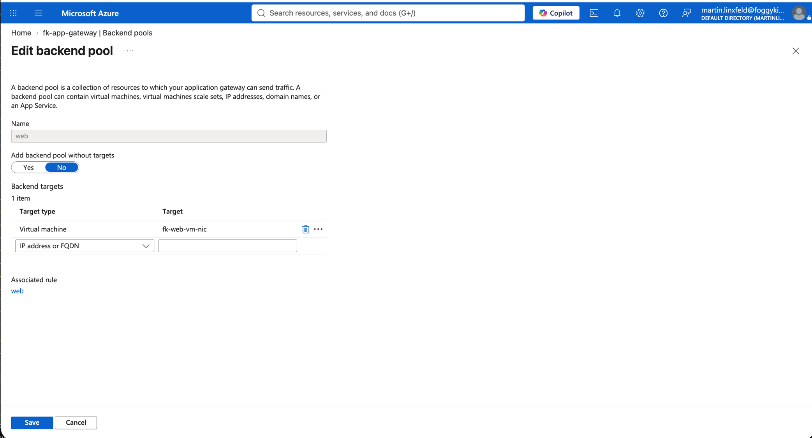
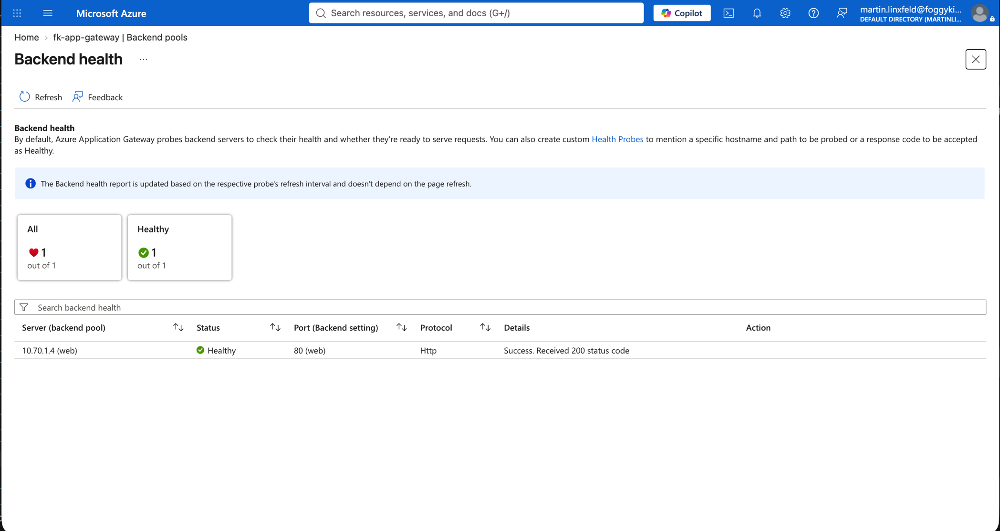
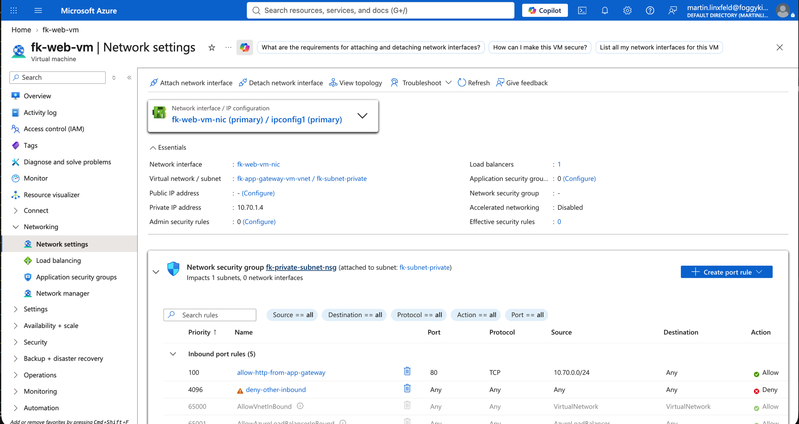
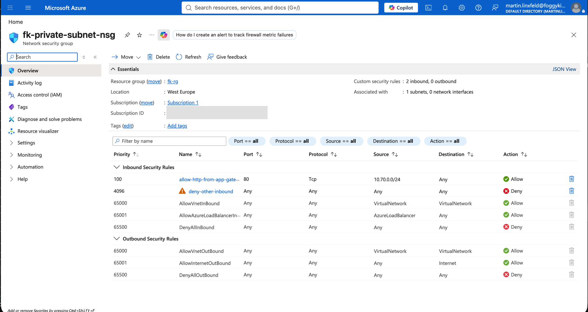
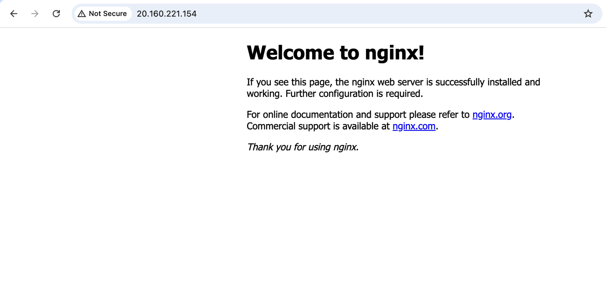

# Example 07: Single VM behind Azure Application Gateway

In this compute example, we deploy a **single VM** behind
**Azure Application Gateway** using **Terraform / OpenTofu**.

The example focuses on the compute module's **explicit backend pool attachment**,
composing it with the dedicated `terraform-az-fk-application-gateway` module.

---

## 🧭 Architecture Overview



This deployment creates:

- One **Resource Group**, following the `resource_group.tf` convention in examples 01–06

- One **Virtual Network** via `terraform-az-fk-vnet`
- Two subnets: **`fk-subnet-app-gateway`** (`10.70.0.0/24`) and
  **`fk-subnet-private`** (`10.70.1.0/24`)
- One **Standard Public IP** via `terraform-az-fk-public-ip`
- One **Standard_v2 Application Gateway** via `terraform-az-fk-application-gateway`
- One **Linux VM** with a single **NIC** and static private IP `10.70.1.4` via `terraform-az-fk-compute`
- One **Network Security Group** on the compute subnet via `terraform-az-fk-nsg`
- One **NAT Gateway** via `terraform-az-fk-natgw` for compute outbound connectivity
- Cloud-init configuration that installs and starts **NGINX**

Traffic flow:

Internet → Application Gateway HTTP listener → `web` backend pool → Single VM (NGINX)

The gateway and compute share a VNet and use separate subnets.
Networking and compute are composed through **FoggyKitchen modules**.
The Resource Group is created in `resource_group.tf`, as in examples 01–06.

This is a **compute attachment integration example**, not a full production landing zone.

---

## 🎯 Why This Example Exists

The earlier load-balanced examples use Azure Load Balancer.
This example demonstrates the separate **Application Gateway attachment contract**:

- Pass a gateway backend pool ID through `app_gateway_attachment`
- Consume the gateway module's real `backend_address_pool_ids` output
- Keep gateway creation and compute attachment as explicit module composition
- Preserve the existing `lb_attachment` contract, which can be used independently
  or simultaneously with `app_gateway_attachment`

The VM NIC joins the gateway pool through
`azurerm_network_interface_application_gateway_backend_address_pool_association`,
created inside the compute module.

---

## ⚙️ Inputs Worth Noting

- `resource_group_name` — name of the Azure Resource Group to create
- `location` — Azure region; defaults to `westeurope`
- `subnets` — purpose-driven subnet map, following examples 01–06
- `ssh_public_key` — your SSH public key; never supply a private key
- `vm_size` — Azure VM size; defaults to `Standard_B1s`, as in examples 01–06

### Backend Pool Initialization

The gateway creates an empty `web` backend pool (`web = {}`). The compute
module then registers the VM NIC or VMSS instances through the pool ID.
No seed IP or external backend is required. Do not also list the attached NIC's
IP in `ip_addresses`: Azure rejects duplicate membership through an explicit
address and a NIC association.

Application Gateway is pinned to **v0.1.2**. Public IP is pinned to **v1.0.0**.
The compute module uses the local repository source (`../..`) so validation
checks the implementation under development.

---

## 🚀 Deployment Steps

From the `examples/07_app_gateway_backend_attachment_vm` directory:

1. Set `TF_VAR_resource_group_name` to the Resource Group name to create.
2. Set `TF_VAR_ssh_public_key` to the contents of your SSH public key file.

Check the configuration before deployment:

```bash
tofu fmt -check
tofu init -backend=false
tofu validate
```

For a deployment in your own subscription, after reviewing the configuration:

```bash
tofu plan
tofu apply
```

NAT Gateway supplies outbound connectivity for NGINX installation. Check that
any existing routing and policies allow gateway traffic to TCP/80.
The compute NSG allows TCP/80 from `10.70.0.0/24` and denies other inbound
traffic, including SSH. Default outbound rules remain available for cloud-init.
The backend compute has no directly attached public IP.

---

## 🔧 Key Module Pattern

The attachment is configured in `compute.tf`:

```hcl
app_gateway_attachment = {
  backend_pool_id = module.app_gateway.backend_address_pool_ids["web"]
}
```

The compute deployment mode is `"vm"`.
The `attached_app_gateway_backend_pool_ids` output returns the attached gateway
pool ID as a list. The existing `attached_backend_pool_ids` output remains LB-only.

Configuration follows the repository's split-file convention:

- `resource_group.tf` — Resource Group creation
- `networks.tf` — VNet, subnets and NAT Gateway module composition
- `nsg.tf` — compute subnet NSG, HTTP from gateway subnet only
- `public_ip.tf` — gateway Public IP module
- `application_gateway.tf` — listeners, probes, routing and backend pool
- `compute.tf` — compute module and backend attachment
- `outputs.tf` — compute ID, gateway pool IDs and public IP
- `variables.tf` and `providers.tf` — inputs and provider requirements

---

## ✅ Validation

The configuration consumes Application Gateway **v0.1.2**, which supports
empty backend pools for compute attachments. `tofu fmt -check`, `tofu init`
and `tofu validate` verify the configuration and module contracts; they do not
prove deployed backend health or connectivity.

### Deployment Result

The corrected configuration was deployed successfully on 2026-10-06:

```console
Apply complete! Resources: 16 added, 0 changed, 0 destroyed.
```

The VM NIC attachment completed successfully with the initially empty gateway
backend pool.

### Backend Health Test

Run from this example directory. The tested resource group was `fk-rg`:

```bash
az network application-gateway show-backend-health \
  --resource-group "$(tofu output -raw resource_group_name)" \
  --name fk-app-gateway \
  --query 'backendAddressPools[].backendHttpSettingsCollection[].servers[].{address:address,health:health,detail:healthProbeLog}' \
  --output json
```

Observed result:

```json
[
  {
    "address": "10.70.1.4",
    "detail": "Success. Received 200 status code",
    "health": "Healthy"
  }
]
```

### HTTP End-to-End Test

Request the public gateway frontend using the deployed output:

```bash
curl -sS -i --max-time 30 "http://$(tofu output -raw gateway_public_ip)/"
```

The tested frontend was `20.160.221.154`. The response included:

```console
HTTP/1.1 200 OK
Content-Type: text/html
Server: nginx/1.18.0 (Ubuntu)
```

The HTML contained `<h1>Welcome to nginx!</h1>`. This verifies HTTP traffic
through the gateway to NGINX on the private VM. For the browser check, open the
same public URL and capture the welcome page with the address bar visible.

These results verify the deployed lab's backend health and HTTP request path;
they do not constitute load, failover, or security testing.

---

## 🖼️ Azure Portal View

The following screenshots document the deployed lab.



*Figure 2. Resources belonging to fk-rg, including Application Gateway, NAT Gateway, public IPs, VNet, NSG, VM, NIC and OS disk.*



*Figure 3. Public frontend 20.160.221.154 associated with the HTTP listener.*



*Figure 4. The web backend pool with one associated rule and one target.*



*Figure 6. The web pool contains a Virtual machine target through fk-web-vm-nic; no explicit IP address or FQDN target is configured.*



*Figure 6. Backend 10.70.1.4 is Healthy on HTTP port 80; the probe received status code 200.*



*Figure 7. The VM uses private IP 10.70.1.4 without a public IP. Its private subnet has the NSG attached.*



*Figure 8. Inbound TCP/80 is allowed from 10.70.0.0/24 at priority 100; other inbound traffic is denied at priority 4096.*



*Figure 9. The public Application Gateway frontend serves the NGINX welcome page.*

---

## 🧹 Cleanup

After your own deployment:

```bash
tofu destroy
```

The Resource Group is managed by this example.

---

## 🪪 License

Licensed under the **Universal Permissive License (UPL), Version 1.0**.
See [LICENSE](../../LICENSE) for details.

---

© 2026 [FoggyKitchen.com](https://foggykitchen.com) - Cloud. Code. Clarity.
